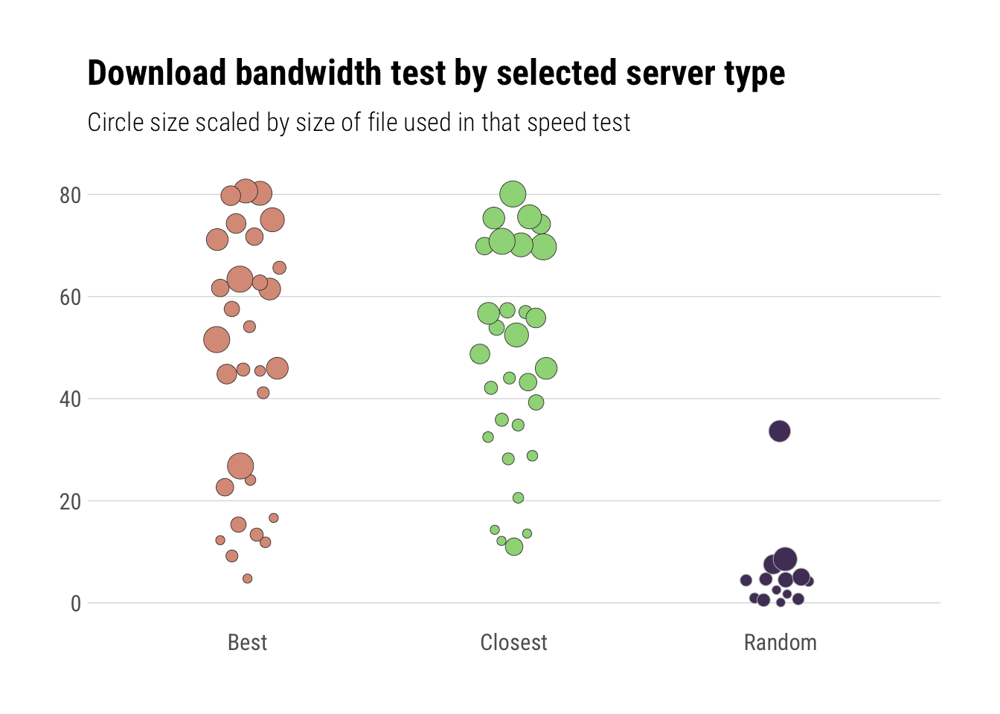
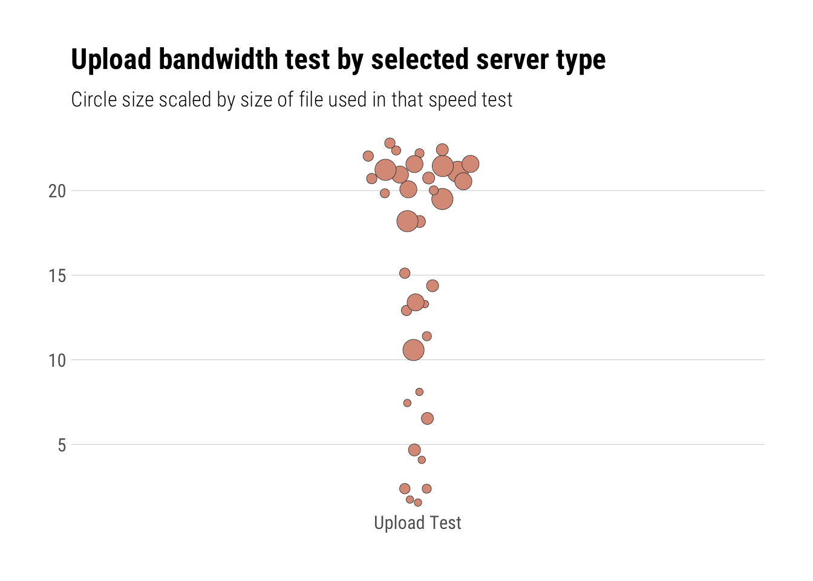

speedtest
================

[](https://www.repostatus.org/#active)
[](https://keybase.io/hrbrmstr)

[](https://travis-ci.org/hrbrmstr/speedtest)
[](https://codecov.io/gh/hrbrmstr/speedtest)


# speedtest

Tools to Test and Compare Internet Bandwidth Speeds

## Description

The ‘Ookla’ ‘Speedtest’ site <http://beta.speedtest.net/about> provides
interactive and programmatic services to test and compare bandwidth
speeds from a source node on the Internet to thousands of test servers.
Tools are provided to obtain test server lists, identify target servers
for testing and performing speed/bandwidth tests.

## What’s Inside The Tin

The following functions are implemented:

  - `nice_speed`: Convert a test speed, in Mbits/s, to its string
    representation along with appropriate units for the magnitude of the
    test speed
  - `spd_best_servers`: Find “best” servers (latency-wise) from master
    server list
  - `spd_closest_servers`: Find “closest” servers (geography-wise) from
    master server list
  - `spd_compute_bandwidth`: Compute bandwidth from bytes transferred
    and time taken
  - `spd_config`: Retrieve client configuration information for the
    speedtest
  - `spd_download_test`: Perform a download speed/bandwidth test
  - `spd_servers`: Retrieve a list of SpeedTest servers
  - `spd_test`: Test your internet speed/bandwidth
  - `spd_upload_test`: Perform an upload speed/bandwidth test

## Make a CLI utility

While you can run `spd_test()` from an R console, it was desgined to be
an easily wrapped into a `bash` (et al) alias or put into a small batch
script. Or, you can just type out the following if you’re
fleet-of-finger/have dexterous digits:

    Rscript --quiet -e 'speedtest::spd_test()'

which will look something like:


## TODO

Folks interested in contributing can take a look at the TODOs and pick
as many as you like\! Ones with question marks are truly a “I dunno if
we shld” kinda thing. Ones with exclamation marks are essentials.

  - [ ] Cache config in memory at startup vs pass around to functions?
  - [ ] Figure out how to use beta sockets hidden API vs the old Flash
    API?
  - [ ] Ensure the efficacy of relying on the cURL timings for speed
    measures for the Flash API
  - [ ] Figure out best way to capture the results for post-processing
  - [ ] Upload results to speedtest (tis only fair)\!
  - [ ] Incorporate more network or host measures for better statistical
    determination of the best target\!
  - [ ] `autoplot` support\!
  - [ ] RStudio Add-in
  - [ ] Shiny app?

## Installation

``` r
install.packages("speedtest", repos = "https://cinc.rud.is")
# or
remotes::install_git("https://git.rud.is/hrbrmstr/speedtest.git")
# or
remotes::install_git("https://git.sr.ht/~hrbrmstr/speedtest")
# or
remotes::install_gitlab("hrbrmstr/speedtest")
# or
remotes::install_bitbucket("hrbrmstr/speedtest")
# or
remotes::install_github("hrbrmstr/speedtest")
```

NOTE: To use the ‘remotes’ install options you will need to have the
[{remotes} package](https://github.com/r-lib/remotes) installed.

## Usage

``` r
library(speedtest)
library(stringi)
library(hrbrthemes)
library(ggbeeswarm)
library(tidyverse)

# current verison
packageVersion("speedtest")
## [1] '0.2.0'
```

### Download Speed

``` r
config <- spd_config()

servers <- spd_servers(config=config)
closest_servers <- spd_closest_servers(servers, config=config)
only_the_best_severs <- spd_best_servers(closest_servers, config)
```

### Individual download tests

``` r
glimpse(spd_download_test(closest_servers[1,], config=config))
## Observations: 1
## Variables: 15
## $ url     <chr> "http://oak-speedtest.otelco.com:8080/speedtest/upload.php"
## $ lat     <dbl> 43.6614
## $ lng     <dbl> -70.2558
## $ name    <chr> "Portland, ME"
## $ country <chr> "United States"
## $ cc      <chr> "US"
## $ sponsor <chr> "Otelco"
## $ id      <chr> "1037"
## $ host    <chr> "oak-speedtest.otelco.com:8080"
## $ url2    <chr> "http://66.181.127.42/speedtest/upload.php"
## $ min     <dbl> 12.16723
## $ mean    <dbl> 14.91807
## $ median  <dbl> 14.57376
## $ max     <dbl> 17.30854
## $ sd      <dbl> 1.736132

glimpse(spd_download_test(only_the_best_severs[1,], config=config))
## Observations: 1
## Variables: 17
## $ total_time     <dbl> 0.075129
## $ retrieval_time <dbl> 2.8e-05
## $ url            <chr> "http://stosat-ndhm-01.sys.comcast.net:8080/speedtest/upload.php"
## $ lat            <dbl> 42.3578
## $ lng            <dbl> -71.0617
## $ name           <chr> "Boston, MA"
## $ country        <chr> "United States"
## $ cc             <chr> "US"
## $ sponsor        <chr> "Comcast"
## $ id             <chr> "1774"
## $ host           <chr> "stosat-ndhm-01.sys.comcast.net:8080"
## $ url2           <chr> "http://a-stosat-ndhm-01.sys.comcast.net/speedtest/upload.php"
## $ min            <dbl> 14.49186
## $ mean           <dbl> 17.68452
## $ median         <dbl> 16.75617
## $ max            <dbl> 24.3737
## $ sd             <dbl> 2.987197
```

### Individual upload tests

``` r
glimpse(spd_upload_test(only_the_best_severs[1,], config=config))
## Observations: 1
## Variables: 17
## $ total_time     <dbl> 0.075129
## $ retrieval_time <dbl> 2.8e-05
## $ url            <chr> "http://stosat-ndhm-01.sys.comcast.net:8080/speedtest/upload.php"
## $ lat            <dbl> 42.3578
## $ lng            <dbl> -71.0617
## $ name           <chr> "Boston, MA"
## $ country        <chr> "United States"
## $ cc             <chr> "US"
## $ sponsor        <chr> "Comcast"
## $ id             <chr> "1774"
## $ host           <chr> "stosat-ndhm-01.sys.comcast.net:8080"
## $ url2           <chr> "http://a-stosat-ndhm-01.sys.comcast.net/speedtest/upload.php"
## $ min            <dbl> 9.951216
## $ mean           <dbl> 20.33949
## $ median         <dbl> 22.11265
## $ max            <dbl> 23.4545
## $ sd             <dbl> 5.148238

glimpse(spd_upload_test(closest_servers[1,], config=config))
## Observations: 1
## Variables: 15
## $ url     <chr> "http://oak-speedtest.otelco.com:8080/speedtest/upload.php"
## $ lat     <dbl> 43.6614
## $ lng     <dbl> -70.2558
## $ name    <chr> "Portland, ME"
## $ country <chr> "United States"
## $ cc      <chr> "US"
## $ sponsor <chr> "Otelco"
## $ id      <chr> "1037"
## $ host    <chr> "oak-speedtest.otelco.com:8080"
## $ url2    <chr> "http://66.181.127.42/speedtest/upload.php"
## $ min     <dbl> 5.646166
## $ mean    <dbl> 16.96393
## $ median  <dbl> 19.76833
## $ max     <dbl> 22.18757
## $ sd      <dbl> 6.542608
```

### Moar download tests

Choose closest, “best” and randomly (there can be, and are, some dups as
a result for best/closest), run the test and chart the results. This
will show just how disparate the results are from these core/crude
tests. Most of the test servers compensate when they present the
results. Newer, “socket”-based tests are more accurate but there are no
free/hidden exposed APIs yet for most of them.

``` r
set.seed(8675309)

bind_rows(

  closest_servers[1:3,] %>%
    mutate(type="closest"),

  only_the_best_severs[1:3,] %>%
    mutate(type="best"),

  filter(servers, !(id %in% c(closest_servers[1:3,]$id, only_the_best_severs[1:3,]$id))) %>%
    sample_n(3) %>%
    mutate(type="random")

) %>%
  group_by(type) %>%
  ungroup() -> to_compare

select(to_compare, sponsor, name, country, host, type)
## # A tibble: 9 x 5
##   sponsor             name           country            host                                 type   
##   <chr>               <chr>          <chr>              <chr>                                <chr>  
## 1 Otelco              Portland, ME   United States      oak-speedtest.otelco.com:8080        closest
## 2 netBlazr            Somerville, MA United States      speed0.xcelx.net:8080                closest
## 3 Comcast             Boston, MA     United States      stosat-ndhm-01.sys.comcast.net:8080  closest
## 4 Comcast             Boston, MA     United States      stosat-ndhm-01.sys.comcast.net:8080  best   
## 5 netBlazr            Somerville, MA United States      speed0.xcelx.net:8080                best   
## 6 BELD Broadband      Braintree, MA  United States      wotan.beld.net:8080                  best   
## 7 LLC Trans Analitika Novaya Usman   Russian Federation speedtest-1.cnetvrn.ru:8080          random 
## 8 VEGA Kharkiv        Kharkiv        Ukraine            speedtest.vega.com.ua:8080           random 
## 9 Oxylion S.A         Katowice       Poland             speedtest-kat-01.oxylion.net.pl:8080 random

map_df(1:nrow(to_compare), ~{
  spd_download_test(to_compare[.x,], config=config, summarise=FALSE, timeout=30)
}) -> dl_results_full

mutate(dl_results_full, type=stri_trans_totitle(type)) %>%
  ggplot(aes(type, bw, fill=type)) +
  geom_quasirandom(aes(size=size, color=type), width=0.15, shape=21, stroke=0.25) +
  scale_y_continuous(expand=c(0,5)) +
  scale_size(range=c(2,6)) +
  scale_color_manual(values=c(Random="#b2b2b2", Best="#2b2b2b", Closest="#2b2b2b")) +
  scale_fill_ipsum() +
  labs(x=NULL, y=NULL, title="Download bandwidth test by selected server type",
       subtitle="Circle size scaled by size of file used in that speed test") +
  theme_ipsum_rc(grid="Y") +
  theme(legend.position="none")
```



### Moar upload tests

Choose closest and “best” and filter duplicates out since we’re really
trying to measure here vs show the disparity:

``` r
bind_rows(
  closest_servers[1:3,] %>% mutate(type="closest"),
  only_the_best_severs[1:3,] %>% mutate(type="best")
) %>%
  distinct(.keep_all=TRUE) -> to_compare

select(to_compare, sponsor, name, country, host, type)
## # A tibble: 6 x 5
##   sponsor        name           country       host                                type   
##   <chr>          <chr>          <chr>         <chr>                               <chr>  
## 1 Otelco         Portland, ME   United States oak-speedtest.otelco.com:8080       closest
## 2 netBlazr       Somerville, MA United States speed0.xcelx.net:8080               closest
## 3 Comcast        Boston, MA     United States stosat-ndhm-01.sys.comcast.net:8080 closest
## 4 Comcast        Boston, MA     United States stosat-ndhm-01.sys.comcast.net:8080 best   
## 5 netBlazr       Somerville, MA United States speed0.xcelx.net:8080               best   
## 6 BELD Broadband Braintree, MA  United States wotan.beld.net:8080                 best

map_df(1:nrow(to_compare), ~{
  spd_upload_test(to_compare[.x,], config=config, summarise=FALSE, timeout=30)
}) -> ul_results_full

ggplot(ul_results_full, aes(x="Upload Test", y=bw)) +
  geom_quasirandom(aes(size=size, fill="col"), width=0.1, shape=21, stroke=0.25, color="#2b2b2b") +
  scale_y_continuous(expand=c(0,0.5)) +
  scale_size(range=c(2,6)) +
  scale_fill_ipsum() +
  labs(x=NULL, y=NULL, title="Upload bandwidth test by selected server type",
       subtitle="Circle size scaled by size of file used in that speed test") +
  theme_ipsum_rc(grid="Y") +
  theme(legend.position="none")
```



## speedtest Metrics

| Lang | \# Files |  (%) | LoC |  (%) | Blank lines |  (%) | \# Lines |  (%) |
| :--- | -------: | ---: | --: | ---: | ----------: | ---: | -------: | ---: |
| R    |       13 | 0.87 | 226 | 0.73 |          68 | 0.53 |      180 | 0.74 |
| Rmd  |        1 | 0.07 |  64 | 0.21 |          51 | 0.40 |       63 | 0.26 |
| make |        1 | 0.07 |  20 | 0.06 |           9 | 0.07 |        0 | 0.00 |

## Code of Conduct

Please note that this project is released with a Contributor Code of
Conduct. By participating in this project you agree to abide by its
terms.
