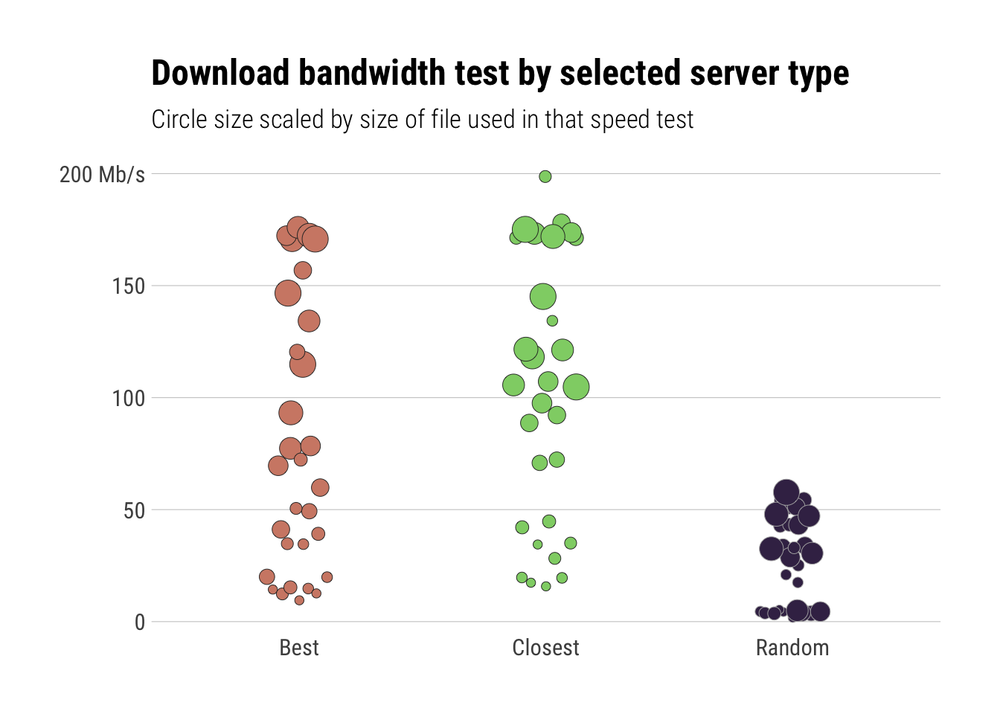
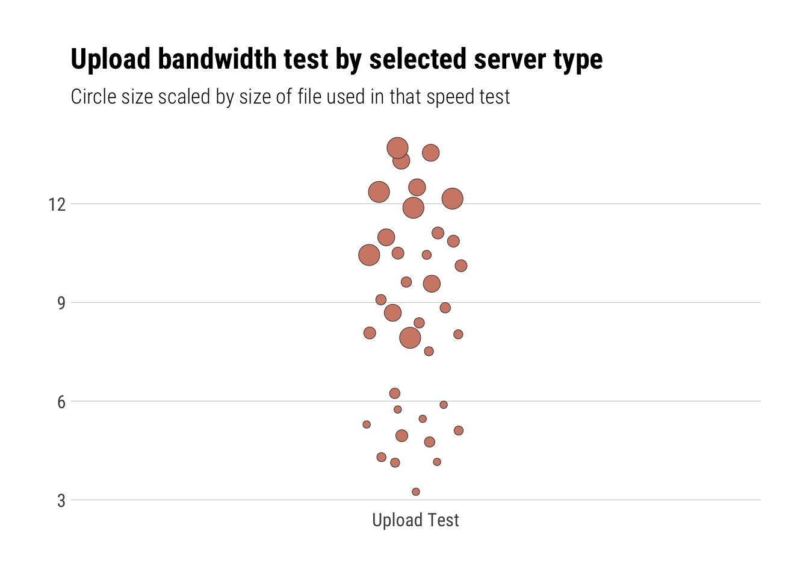

speedtest
================

Tools to Test and Compare Internet Bandwidth Speeds

## Description

The ‘Ookla’ ‘Speedtest’ site <http://beta.speedtest.net/about> provides
interactive and programmatic services to test and compare bandwidth
speeds from a source node on the Internet to thousands of test servers.
Tools are provided to obtain test server lists, identify target servers
for testing and performing speed/bandwidth tests.

## What’s Inside The Tin

The following functions are implemented:

  - `spd_best_servers`: Find “best” servers (latency-wise) from master
    server list
  - `spd_closest_servers`: Find “closest” servers (geography-wise) from
    master server list
  - `spd_compute_bandwidth`: Compute bandwidth from bytes transferred
    and time taken
  - `spd_config`: Retrieve client configuration information for the
    speedtest
  - `spd_download_test`: Perform a download speed/bandwidth test
  - `spd_servers`: Retrieve a list of SpeedTest servers
  - `spd_upload_test`: Perform an upload speed/bandwidth test
  - `spd_test`: Test your internet speed/bandwidth

## Make a CLI utility

While you can run `spd_test()` from an R console, it was desgined to be
an easily wrapped into a `bash` (et al) alias or put into a small batch
script. Or, you can just type out the following if you’re
fleet-of-finger/have dexterous digits:

    Rscript --quiet -e 'speedtest::spd_test()'

which will look something like:


## TODO

Folks interested in contributing can take a look at the TODOs and pick
as many as you like\! Ones with question marks are truly a “I dunno if
we shld” kinda thing. Ones with exclamation marks are essentials.

  - \[ \] Cache config in memory at startup vs pass around to functions?
  - \[ \] Figure out how to use beta sockets hidden API vs the old Flash
    API?
  - \[ \] Ensure the efficacy of relying on the cURL timings for speed
    measures for the Flash API
  - \[ \] Figure out best way to capture the results for post-processing
  - \[ \] Upload results to speedtest (tis only fair)\!
  - \[ \] Incorporate more network or host measures for better
    statistical determination of the best target\!
  - \[ \] `autoplot` support\!
  - \[ \] RStudio Add-in
  - \[ \] Shiny app?

## Installation

``` r
devtools::install_github("hrbrmstr/speedtest")
```

``` r
options(width=120)
```

## Usage

``` r
library(speedtest)
library(stringi)
library(hrbrthemes)
library(ggbeeswarm)
library(tidyverse)

# current verison
packageVersion("speedtest")
```

    ## [1] '0.1.0'

### Download Speed

``` r
config <- spd_config()

servers <- spd_servers(config=config)
closest_servers <- spd_closest_servers(servers, config=config)
only_the_best_severs <- spd_best_servers(closest_servers, config)
```

### Individual download tests

``` r
glimpse(spd_download_test(closest_servers[1,], config=config))
```

    ## Observations: 1
    ## Variables: 15
    ## $ url     <chr> "http://speed0.xcelx.net/speedtest/upload.php"
    ## $ lat     <dbl> 42.3875
    ## $ lng     <dbl> -71.1
    ## $ name    <chr> "Somerville, MA"
    ## $ country <chr> "United States"
    ## $ cc      <chr> "US"
    ## $ sponsor <chr> "Axcelx Technologies LLC"
    ## $ id      <chr> "5960"
    ## $ host    <chr> "speed0.xcelx.net:8080"
    ## $ url2    <chr> "http://speed1.xcelx.net/speedtest/upload.php"
    ## $ min     <dbl> 14.40439
    ## $ mean    <dbl> 60.06834
    ## $ median  <dbl> 55.28457
    ## $ max     <dbl> 127.9436
    ## $ sd      <dbl> 34.20695

``` r
glimpse(spd_download_test(only_the_best_severs[1,], config=config))
```

    ## Observations: 1
    ## Variables: 18
    ## $ ping_time      <dbl> 0.02712567
    ## $ total_time     <dbl> 0.059917
    ## $ retrieval_time <dbl> 2.3e-05
    ## $ url            <chr> "http://speed0.xcelx.net/speedtest/upload.php"
    ## $ lat            <dbl> 42.3875
    ## $ lng            <dbl> -71.1
    ## $ name           <chr> "Somerville, MA"
    ## $ country        <chr> "United States"
    ## $ cc             <chr> "US"
    ## $ sponsor        <chr> "Axcelx Technologies LLC"
    ## $ id             <chr> "5960"
    ## $ host           <chr> "speed0.xcelx.net:8080"
    ## $ url2           <chr> "http://speed1.xcelx.net/speedtest/upload.php"
    ## $ min            <dbl> 14.64922
    ## $ mean           <dbl> 56.15303
    ## $ median         <dbl> 51.89162
    ## $ max            <dbl> 107.5084
    ## $ sd             <dbl> 31.8866

### Individual upload tests

``` r
glimpse(spd_upload_test(only_the_best_severs[1,], config=config))
```

    ## Observations: 1
    ## Variables: 18
    ## $ ping_time      <dbl> 0.02712567
    ## $ total_time     <dbl> 0.059917
    ## $ retrieval_time <dbl> 2.3e-05
    ## $ url            <chr> "http://speed0.xcelx.net/speedtest/upload.php"
    ## $ lat            <dbl> 42.3875
    ## $ lng            <dbl> -71.1
    ## $ name           <chr> "Somerville, MA"
    ## $ country        <chr> "United States"
    ## $ cc             <chr> "US"
    ## $ sponsor        <chr> "Axcelx Technologies LLC"
    ## $ id             <chr> "5960"
    ## $ host           <chr> "speed0.xcelx.net:8080"
    ## $ url2           <chr> "http://speed1.xcelx.net/speedtest/upload.php"
    ## $ min            <dbl> 6.240858
    ## $ mean           <dbl> 9.527599
    ## $ median         <dbl> 9.303148
    ## $ max            <dbl> 12.56686
    ## $ sd             <dbl> 2.451778

``` r
glimpse(spd_upload_test(closest_servers[1,], config=config))
```

    ## Observations: 1
    ## Variables: 15
    ## $ url     <chr> "http://speed0.xcelx.net/speedtest/upload.php"
    ## $ lat     <dbl> 42.3875
    ## $ lng     <dbl> -71.1
    ## $ name    <chr> "Somerville, MA"
    ## $ country <chr> "United States"
    ## $ cc      <chr> "US"
    ## $ sponsor <chr> "Axcelx Technologies LLC"
    ## $ id      <chr> "5960"
    ## $ host    <chr> "speed0.xcelx.net:8080"
    ## $ url2    <chr> "http://speed1.xcelx.net/speedtest/upload.php"
    ## $ min     <dbl> 6.764702
    ## $ mean    <dbl> 9.896179
    ## $ median  <dbl> 10.3605
    ## $ max     <dbl> 12.85389
    ## $ sd      <dbl> 2.359868

### Moar download tests

Choose closest, “best” and randomly (there can be, and are, some dups as
a result for best/closest), run the test and chart the results. This
will show just how disparate the results are from these core/crude
tests. Most of the test servers compensate when they present the
results. Newer, “socket”-based tests are more accurate but there are no
free/hidden exposed APIs yet for most of them.

``` r
set.seed(8675309)

bind_rows(

  closest_servers[1:3,] %>%
    mutate(type="closest"),

  only_the_best_severs[1:3,] %>%
    mutate(type="best"),

  filter(servers, !(id %in% c(closest_servers[1:3,]$id, only_the_best_severs[1:3,]$id))) %>%
    sample_n(3) %>%
    mutate(type="random")

) %>%
  group_by(type) %>%
  ungroup() -> to_compare

select(to_compare, sponsor, name, country, host, type)
```

    ## # A tibble: 9 x 5
    ##                   sponsor            name       country
    ##                     <chr>           <chr>         <chr>
    ## 1 Axcelx Technologies LLC  Somerville, MA United States
    ## 2                 Comcast      Boston, MA United States
    ## 3            Starry, Inc.      Boston, MA United States
    ## 4 Axcelx Technologies LLC  Somerville, MA United States
    ## 5 Norwood Light Broadband     Norwood, MA United States
    ## 6       CCI - New England  Providence, RI United States
    ## 7                 PirxNet         Gliwice        Poland
    ## 8           Interoute VDC Los Angeles, CA United States
    ## 9                   UNPAD         Bandung     Indonesia
    ## # ... with 2 more variables: host <chr>, type <chr>

``` r
map_df(1:nrow(to_compare), ~{
  spd_download_test(to_compare[.x,], config=config, summarise=FALSE, timeout=30)
}) -> dl_results_full
```

``` r
mutate(dl_results_full, type=stri_trans_totitle(type)) %>%
  ggplot(aes(type, bw, fill=type)) +
  geom_quasirandom(aes(size=size, color=type), width=0.15, shape=21, stroke=0.25) +
  scale_y_continuous(expand=c(0,5), labels=c(sprintf("%s", seq(0,150,50)), "200 Mb/s"), limits=c(0,200)) +
  scale_size(range=c(2,6)) +
  scale_color_manual(values=c(Random="#b2b2b2", Best="#2b2b2b", Closest="#2b2b2b")) +
  scale_fill_ipsum() +
  labs(x=NULL, y=NULL, title="Download bandwidth test by selected server type",
       subtitle="Circle size scaled by size of file used in that speed test") +
  theme_ipsum_rc(grid="Y") +
  theme(legend.position="none")
```



### Moar upload tests

Choose closest and “best” and filter duplicates out since we’re really
trying to measure here vs show the disparity:

``` r
bind_rows(
  closest_servers[1:3,] %>% mutate(type="closest"),
  only_the_best_severs[1:3,] %>% mutate(type="best")
) %>%
  distinct(.keep_all=TRUE) -> to_compare

select(to_compare, sponsor, name, country, host, type)
```

    ## # A tibble: 6 x 5
    ##                   sponsor           name       country
    ##                     <chr>          <chr>         <chr>
    ## 1 Axcelx Technologies LLC Somerville, MA United States
    ## 2                 Comcast     Boston, MA United States
    ## 3            Starry, Inc.     Boston, MA United States
    ## 4 Axcelx Technologies LLC Somerville, MA United States
    ## 5 Norwood Light Broadband    Norwood, MA United States
    ## 6       CCI - New England Providence, RI United States
    ## # ... with 2 more variables: host <chr>, type <chr>

``` r
map_df(1:nrow(to_compare), ~{
  spd_upload_test(to_compare[.x,], config=config, summarise=FALSE, timeout=30)
}) -> ul_results_full
```

``` r
ggplot(ul_results_full, aes(x="Upload Test", y=bw)) +
  geom_quasirandom(aes(size=size, fill="col"), width=0.1, shape=21, stroke=0.25, color="#2b2b2b") +
  scale_y_continuous(expand=c(0,0.5), breaks=seq(0,16,4),
                     labels=c(sprintf("%s", seq(0,12,4)), "16 Mb/s"), limits=c(0,16)) +
  scale_size(range=c(2,6)) +
  scale_fill_ipsum() +
  labs(x=NULL, y=NULL, title="Upload bandwidth test by selected server type",
       subtitle="Circle size scaled by size of file used in that speed test") +
  theme_ipsum_rc(grid="Y") +
  theme(legend.position="none")
```



## speedtest Metrics

| Lang | \# Files |  (%) | LoC |  (%) | Blank lines |  (%) | \# Lines |  (%) |
| :--- | -------: | ---: | --: | ---: | ----------: | ---: | -------: | ---: |
| HTML |        1 | 0.06 | 819 | 0.73 |          10 | 0.07 |        0 | 0.00 |
| R    |       13 | 0.81 | 215 | 0.19 |          70 | 0.51 |      167 | 0.68 |
| Rmd  |        1 | 0.06 |  64 | 0.06 |          49 | 0.36 |       78 | 0.32 |
| make |        1 | 0.06 |  20 | 0.02 |           9 | 0.07 |        0 | 0.00 |

## Code of Conduct

Please note that this project is released with a [Contributor Code of
Conduct](CONDUCT.md). By participating in this project you agree to
abide by its terms.
